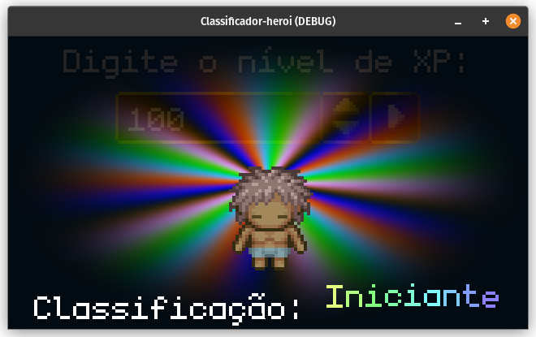

# Classificador de Nível de Herói 🦸‍♀️

Projeto inspirado pelo exercício em JavaScript proposto no curso **Base em lógica de programação para jogos** da [dio.me](https://web.dio.me/home)

### O mesmo solicita o uso de conceitos e elementos básicos como:
- Variáveis;
- Operadores;
- Loops;
- Estrutura de decisão.

O objetivo da aplicação é determinar uma nomenclatura para um herói de RPG de acordo com a quantidade de experiência do mesmo. No presente projeto a **Godot Engine** foi utilizada para exibir visualmente o herói segundo a quantidade de xp inserida em um campo numérico.

A partir do que é sugerido na aula foi criada uma tabela de nomenclatura vs experiência conforme segue:
| Experiência  | Classificação |
| ------------- | ------------- |
| >= 100  | Iniciante  |
| >= 1.000  | Aprendiz  |
| >= 5.000  | Soldado  |
| >= 10.000  | Guerreiro  |
| >= 20.000  | Herói  |

Próximos passos planejados para o projeto:
| OK? | Feature |
| --- | --- |
| ✅ | Release inicial  |
| ⛔ | Indicador de level segundo a quantidade de XP  |
| ⛔ | Atualizar os créditos com as licenças completas da Godot e do Pipoya  |
| ✅ | Publicação no Github Pages via CI/CD  |
